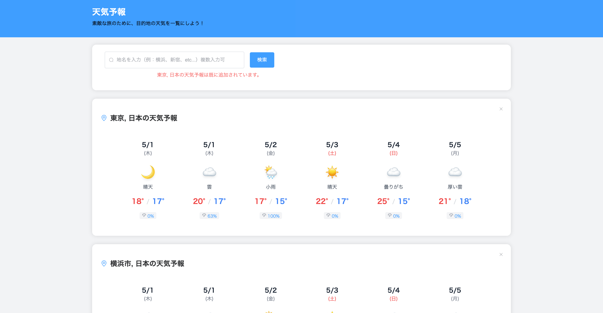

# 天気予報アプリ

Vue 3 + TypeScriptで作成された、複数地域の天気予報を表示できるシンプルなウェブアプリケーションです。




## 機能

- 複数地域の天気予報を同時に表示
- 5日間の天気予報（最高気温、最低気温、天気、降水確率）
- 重複する地域の追加を防止
- 地域ごとの天気予報の削除機能
- レスポンシブデザイン（モバイル対応）
- 固定ヘッダーによる使いやすいUI

## 技術スタック

- Vue 3
- TypeScript
- Pinia（状態管理）
- Element Plus（UIコンポーネント）
- OpenWeather API（天気データ）

## 開発環境のセットアップ

```bash
# 依存関係のインストール
npm install

# 開発サーバーの起動
npm run dev

# ビルド
npm run build
```

## 環境変数

`.env`ファイルに以下の環境変数を設定してください：

```
VITE_OPENWEATHER_API_KEY=あなたのAPIキー
```

## ライセンス

MIT

## Recommended IDE Setup

## Customize configuration

See [Vite Configuration Reference](https://vitejs.dev/config/).

## Project Setup

```sh
npm install
```

### Compile and Hot-Reload for Development

```sh
npm run dev
```

### Type-Check, Compile and Minify for Production

```sh
npm run build
```

### Run Unit Tests with [Vitest](https://vitest.dev/)

```sh
npm run test:unit
```

### Lint with [ESLint](https://eslint.org/)

```sh
npm run lint
```
